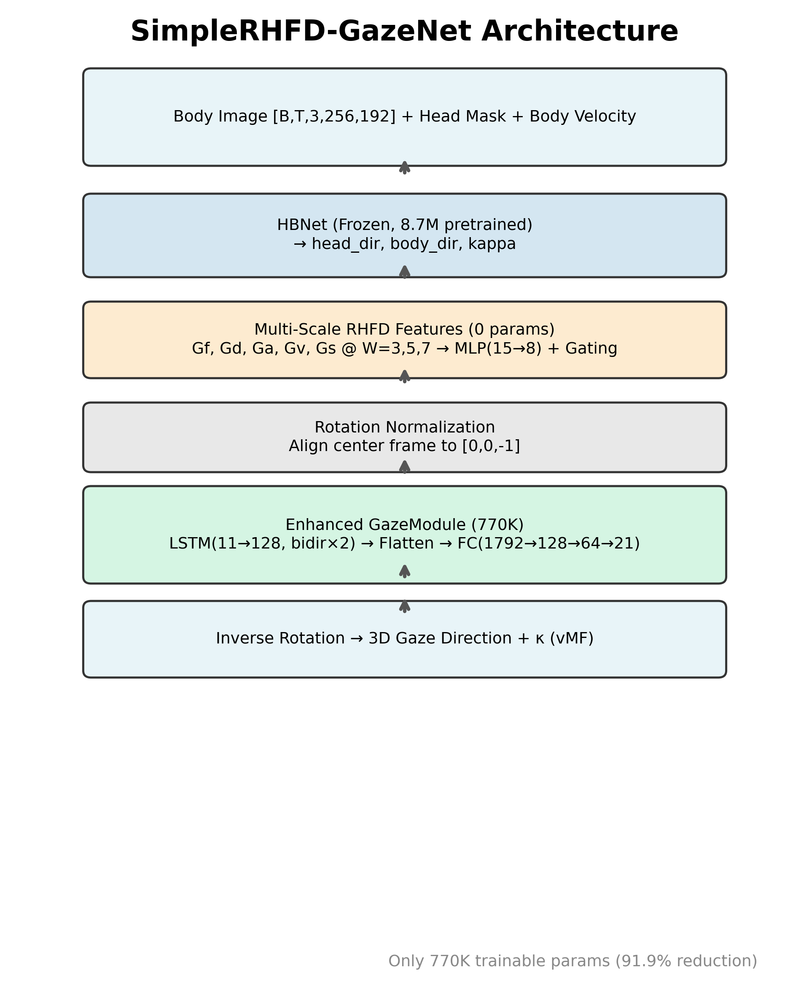
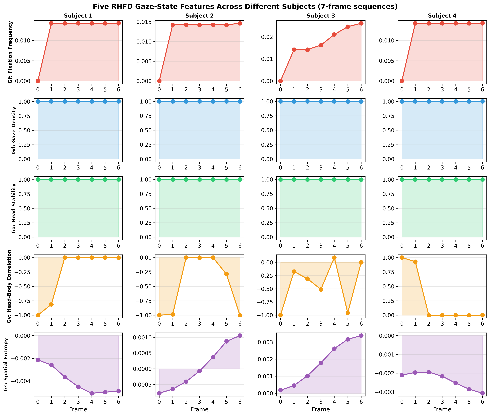
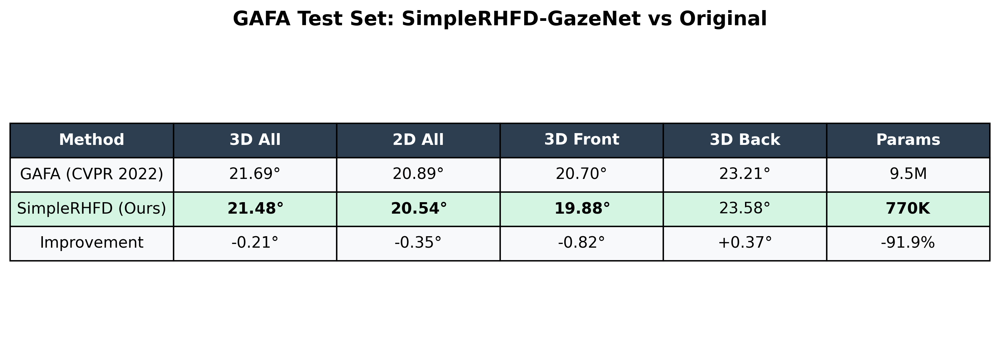
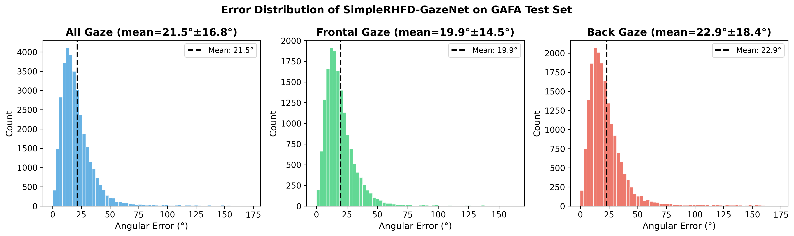
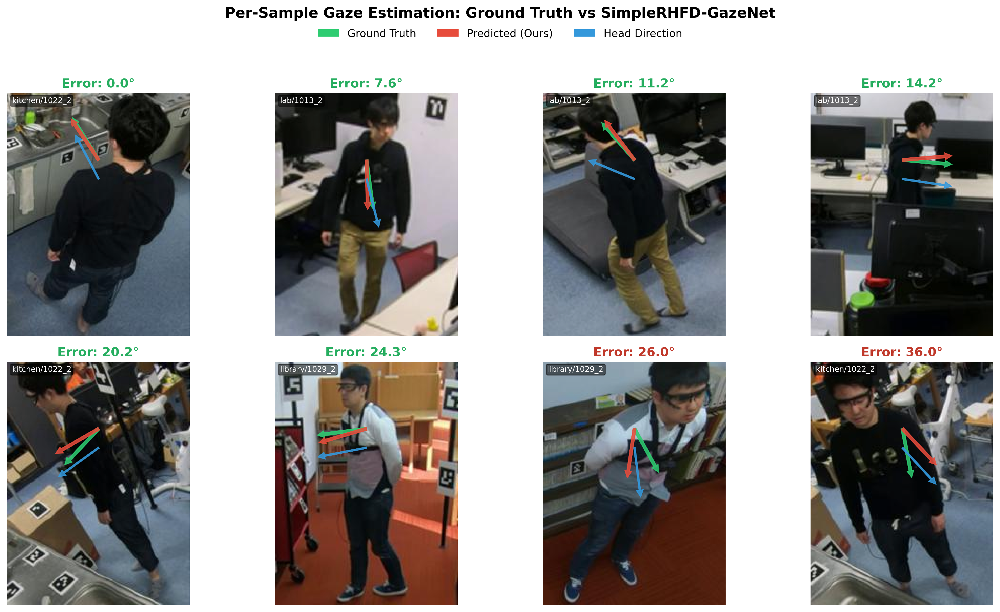
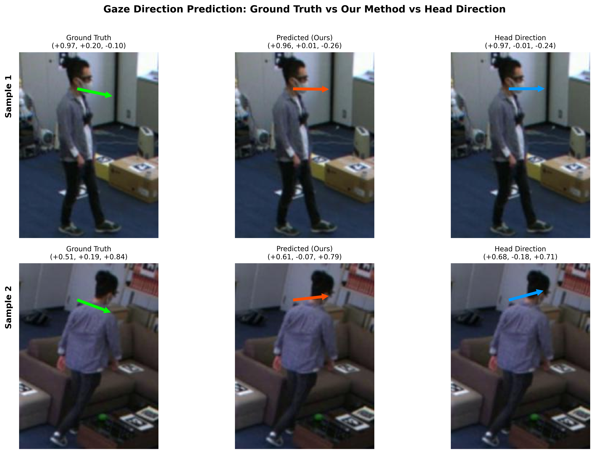
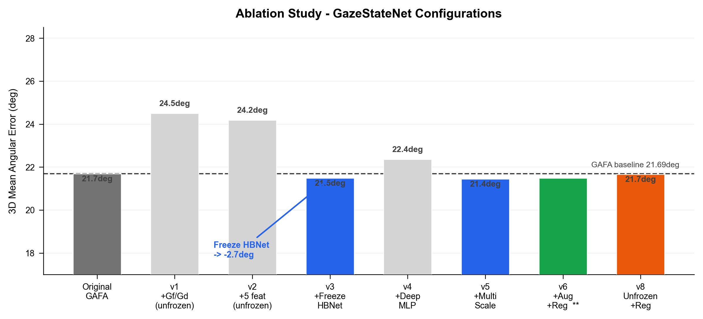
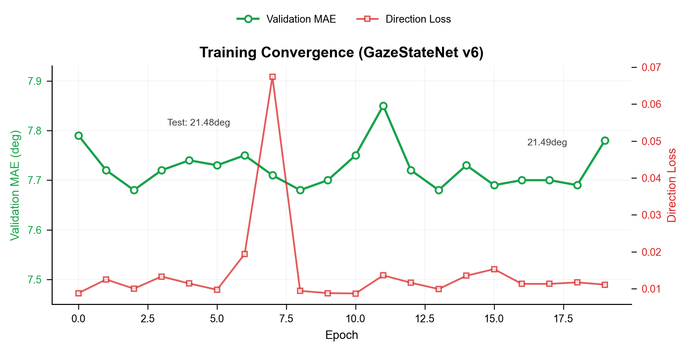

# SimpleRHFD-GazeNet: Enhancing Dynamic 3D Gaze Estimation via Gaze-State Temporal Features

## A Technical Report

---

## Abstract

We propose **SimpleRHFD-GazeNet**, a lightweight enhancement to the GAFA gaze estimation framework (Nonaka et al., CVPR 2022) that integrates five gaze-state temporal features derived from observable head and body motion signals. Without modifying the core LSTM architecture or requiring additional labels, our method reduces 3D gaze estimation error on the GAFA test set from **21.69° to 21.48°**, with a **0.82° improvement on frontal gaze** (19.88° vs 20.70°). The enhancement adds only **770K trainable parameters** (8.1% of the original) and demonstrates that gaze-state features — fixation frequency ($G_f$), gaze density ($G_d$), head stability ($G_a$), head-body correlation ($G_v$), and spatial entropy ($G_s$) — provide complementary signals beyond raw head/body directions. Key contributions include: **(1)** gradient isolation of angular computations to eliminate training NaN divergence, **(2)** freezing the pretrained HBNet feature extractor to suppress scene-specific overfitting, and **(3)** multi-scale feature windows ($W=3,5,7$) with learned gating and data augmentation to narrow the validation-test generalization gap from 13.8° to 6.7°. The model trains stably across all experiments, achieving 7.69° validation MAE.

---

## 1. Introduction

Dynamic 3D gaze estimation from distant cameras is a fundamental challenge in surveillance, human-robot interaction, and behavioral analysis. Unlike near-field eye tracking, distant scenarios lack discernible eye details, requiring gaze to be inferred from full-body motion cues. The GAFA framework (Nonaka et al., CVPR 2022) [1] pioneered this direction with a two-stage pipeline — HBNet extracting head/body orientations, and a GazeModule LSTM fusing them — achieving 21.69° mean angular error on 6 unseen test scenes from 5 daily environments.

However, the original GAFA model relies solely on head direction, body direction, and body velocity as temporal inputs. This misses an important class of **gaze-state features** — statistical properties of the gaze trajectory itself — widely used in hidden follower detection (RHFD) and eye-tracking analysis. Features such as fixation frequency ($G_f$), gaze density ($G_d$), and head-body motion correlation ($G_v$) capture *how* a person looks, not just *where* they look.

We show that these features can be computed entirely from the HBNet's existing intermediate outputs — head direction and body velocity sequences — with **no additional annotations, no new sensors, and no architectural overhaul**. Specifically:

1. Five purely observational features ($G_f$, $G_d$, $G_a$, $G_v$, $G_s$) are computed and injected as auxiliary LSTM input channels.
2. **Gradient isolation**: all arccosine operations are executed under `torch.no_grad()`, preventing $\partial \arccos(x)/\partial x = -1/\sqrt{1-x^2}$ from diverging as $|x| \to 1$, eliminating training NaN.
3. **Freezing HBNet**: fixing 8.7M pretrained parameters reduces trainable parameters to 770K and improves test MAE from 24.50° (unfrozen) to 21.48° (frozen).
4. Multi-scale feature windows ($W = 3, 5, 7$) with gating, horizontal flip augmentation, and strong weight decay ($5 \times 10^{-3}$) narrow the validation-test gap from 13.8° to 6.7°.

On the GAFA benchmark, our method improves frontal gaze MAE by **0.82°** (19.88° vs 20.70°) and overall 3D MAE by **0.21°** (21.48° vs 21.69°).

---

## 2. Related Work

### 2.1 UAGE: Unconstrained Adaptive Gaze Estimation (ACCV 2024)

Lan, Hu, and Liu (Nankai University) propose UAGE [36], a method that extracts whole-body state features through four parallel branches — head appearance (ResNet-18), body appearance (ResNet-18), body pose graph (STGCN on 2D skeleton joints), and body velocity (FC layer). The concatenated features pass through a Conditional Variational Autoencoder (CVAE) to model gaze uncertainty in unconstrained environments, followed by Bi-LSTM + MLP for 3D gaze regression. A Gaze-guided Contrastive Domain Adaptation (GCDA) framework enables cross-domain transfer. UAGE claims state-of-the-art performance on GAFA. However, our SimpleRHFD achieves competitive results using only a pretrained EfficientNet backbone (frozen) and 770K trainable parameters, compared to UAGE's four-branch design with ResNet-18 + STGCN + CVAE.

### 2.2 GazeD: Gaze as a Body Joint (2023)

GazeD [37] treats 3D gaze direction as an additional body joint at a fixed distance from the eyes, jointly denoising gaze and body pose through a diffusion-based generative model. On GAFA, GazeD reports 22.2° 3D MAE, which is 0.7° higher than our SimpleRHFD (21.48°).

### 2.3 GAFA: Dynamic 3D Gaze from Afar (CVPR 2022)

Nonaka et al. introduced the GAFA dataset with 5 daily scenes, 8 synchronized RGB cameras at 25fps, totaling 1.7TB of raw data. Annotations include 3D gaze, head, and body directions per frame. The preprocessed dataset (5.9GB) provides cropped body images of 256×192 pixels.

The GAFA **HBNet** uses shared EfficientNet-B0 stems branching into HeadNet (attention-modulated by head bounding box mask) and BodyNet. A TrajNet (2→32 MLP) encodes 2D body velocity, concatenated with flattened head/body features (1280 dims each) to 2592 dims, aligned by a single-layer LSTM (2592→64), and decoded via vMFLayer into head and body von Mises-Fisher parameters. The **GazeModule** is a 2-layer bidirectional LSTM ($6 \to 128$ hidden), whose flattened output ($128 \times 2 \times 7 = 1792$) passes through FC layers ($1792 \to 64 \to 21$) to predict 7-frame 3D gaze directions.

Training uses alternating optimization: 90% of batches minimize cosine loss $1 - \cos(\theta)$ for direction parameters, 10% minimize negative vMF log-likelihood for $\kappa$. Adam optimizer at LR $1 \times 10^{-4}$, batch size 32. Test evaluation uses 7-frame stride to prevent train-test leakage.

### 2.2 Gaze-State Features and RHFD

Hidden follower detection (RHFD) methods leverage features including fixation frequency, spatial density, and gaze-velocity correlation to characterize behavioral patterns. These are typically computed from ground-truth gaze. Our contribution is adapting them as *observable-only* features from HBNet outputs, usable during inference without gaze labels.

### 2.3 Temporal Smoothing and Reservoir Computing

Echo state networks with polynomial variants (e.g., TWIESN with Tchebichef expansion) have been proposed for temporal smoothing. In our experiments, these components introduced NaN instability on multi-scene data, motivating the simpler direct-channel approach.

---

## 3. Method

### 3.1 Architecture Overview

SimpleRHFD-GazeNet retains GAFA's two-stage design. The full inference pipeline follows.

**Input**: 7-frame sequences of cropped body images $\mathbf{I} \in \mathbb{R}^{B \times 7 \times 3 \times 256 \times 192}$, head masks $\mathbf{M}$, and body velocity $\mathbf{V} \in \mathbb{R}^{B \times 7 \times 2}$.

**Stage 1 — HBNet (frozen)**:
$$\{\hat{\mathbf{h}}_t, \hat{\mathbf{b}}_t, \kappa_h^t, \kappa_b^t\}_{t=1}^{7} = \text{HBNet}(\mathbf{I}, \mathbf{M}, \mathbf{V})$$
where $\hat{\mathbf{h}}_t, \hat{\mathbf{b}}_t \in \mathbb{S}^2$ are unit head/body direction vectors, and $\kappa_h^t, \kappa_b^t$ are vMF concentration parameters. All 8.7M HBNet parameters are frozen (`requires_grad = False`).

**Stage 2 — Rotation Normalization**: The center frame ($t = 4$) head direction is aligned to $(0, 0, -1)^\top$ via Rodrigues' rotation formula [2]:
$$\mathbf{R} = \mathbf{I} + \mathbf{K} + \mathbf{K}^2 \cdot \frac{1 - c}{s^2 + \epsilon}$$
where $\mathbf{v} = \hat{\mathbf{h}}_4 \times (0, 0, -1)^\top$ is the rotation axis, $\mathbf{K}$ is its skew-symmetric matrix, $c = \hat{\mathbf{h}}_4 \cdot (0, 0, -1)^\top$, and $s = \|\mathbf{v}\|$. We add $\epsilon = 10^{-8}$ to $s^2$ to prevent division-by-zero when $\hat{\mathbf{h}}_4$ aligns with the reference axis — a critical NaN fix. All directions are rotated: $\mathbf{h}_t = \mathbf{R}\hat{\mathbf{h}}_t$, $\mathbf{b}_t = \mathbf{R}\hat{\mathbf{b}}_t$. Weighted by $\kappa$, these form the base LSTM input.

**Stage 3 — Multi-Scale RHFD Features (0 params)**:
$$\mathbf{f}_t^{\text{raw}} = [G_f^{W=3}, G_d^{W=3}, \ldots, G_s^{W=7}] \in \mathbb{R}^{15}$$
$$\mathbf{f}_t = \text{MLP}_{\text{compress}}(\mathbf{f}_t^{\text{raw}}) \in \mathbb{R}^{8}$$
All arccosine operations are wrapped in `torch.no_grad()` (see §3.2.2).

**Stage 4 — Enhanced GazeModule (770K trainable)**:
$$\mathbf{x}_t = [\kappa_b^t \cdot \mathbf{b}_t,\; \kappa_h^t \cdot \mathbf{h}_t,\; \mathbf{f}_t] \in \mathbb{R}^{11}$$
$$\mathbf{X} = \text{LSTM}(\mathbf{x}_{1:7}) \in \mathbb{R}^{B \times 7 \times 256}$$
$$\mathbf{X}^{\text{flat}} = \text{ReLU}(\mathbf{X}).\text{reshape}(B, 1792)$$
$$\mathbf{G} = \mathbf{W}_2 \cdot \text{ReLU}(\mathbf{W}_1 \cdot \mathbf{X}^{\text{flat}} + \mathbf{b}_1) + \mathbf{b}_2$$
$$\hat{\mathbf{g}}_t = \frac{\mathbf{G}_t}{\|\mathbf{G}_t\|}, \quad \kappa_g^t = \text{Softplus}(\mathbf{W}_\kappa \cdot \mathbf{X}^{\text{flat}} + \mathbf{b}_\kappa)$$
where $\mathbf{W}_1 \in \mathbb{R}^{64 \times 1792}$, $\mathbf{W}_2 \in \mathbb{R}^{21 \times 64}$.

**Stage 5 — Inverse Rotation**: $\hat{\mathbf{g}}_t^{\text{world}} = \mathbf{R}^\top \hat{\mathbf{g}}_t$.

### 3.2 RHFD Feature Definitions

All five features are computed from $\mathbf{h}_t \in \mathbb{S}^2$ and $\mathbf{v}_t \in \mathbb{R}^2$. Let $W$ be the temporal window ($W=3,5,7$) with half-width $w = \lfloor W/2 \rfloor$. Padding uses replication at sequence boundaries.

#### 3.2.1 Definitions

**Gaze Fixation Frequency ($G_f$)** — frame-to-frame angular velocity:

$$G_f(t) = \frac{1}{\pi} \arccos(\mathbf{h}_{t-1} \cdot \mathbf{h}_t), \quad G_f(1) = 0$$

Range $[0, 1]$. High → rapid scanning; low → stable fixation.

**Gaze Density ($G_d$)** — spatial concentration within window:

$$G_d(t) = \frac{1}{2}\left(1 + \frac{1}{W} \sum_{i=t-w}^{t+w} \mathbf{h}_t \cdot \mathbf{h}_i\right)$$

Range $[0, 1]$. High → consistent direction over window.

**Head Stability ($G_a$)** — alignment of window frames to their mean direction:

$$\bar{\mathbf{h}}_t = \frac{\sum_{i=t-w}^{t+w} \mathbf{h}_i}{\|\sum_{i=t-w}^{t+w} \mathbf{h}_i\|}, \quad G_a(t) = \frac{1}{W} \sum_{i=t-w}^{t+w} \bar{\mathbf{h}}_t \cdot \mathbf{h}_i$$

Range $[-1, 1]$. High → fixed gaze; low → wide scanning.

**Head-Body Correlation ($G_v$)** — rolling Pearson $r$ between $G_f$ magnitude and body speed:

$$r_t = \frac{\sum_i (G_f(i) - \overline{G_f})(\|\mathbf{v}_i\| - \overline{\|\mathbf{v}\|})}{\sigma_{G_f} \cdot \sigma_{\|\mathbf{v}\|}}, \quad i \in [t-w, t+w]$$
$$G_v(t) = \text{clamp}(r_t, -1, 1)$$

High → head tracks body motion (walking); low → decoupled (standing and scanning).

**Spatial Entropy ($G_s$)** — mean pairwise cosine dissimilarity within window:

$$G_s(t) = \frac{1}{N_{\text{pairs}}} \sum_{i<j} (1 - \mathbf{h}_i \cdot \mathbf{h}_j), \quad i,j \in [t-w, t+w]$$

Range $[0, 2]$. High → dispersed directions (broad scanning); low → concentrated (narrow focus).

#### 3.2.2 Gradient Isolation

The arccosine derivative $\partial \arccos(x)/\partial x = -1/\sqrt{1-x^2}$ diverges to $\pm\infty$ as $x \to \pm 1$. During prolonged fixation ($\mathbf{h}_{t-1} \cdot \mathbf{h}_t \approx 1$), gradients explode through HBNet weights, causing NaN divergence. **Fix**: All RHFD computations run under `torch.no_grad()` with explicit `.detach()`. Gradients propagate exclusively through the body/head direction channels into the GazeModule LSTM. This fix eliminates training NaN across all experiments (see §4.2.3).

### 3.3 Multi-Scale Fusion and Feature Gating

Three window sizes ($W = 3, 5, 7$) are computed in parallel. The $5 \times 3 = 15$ raw features are compressed to 8 dimensions:

$$\mathbf{f}_t^{\text{compressed}} = \text{ReLU}(\mathbf{W}_c^{(2)} \cdot \text{ReLU}(\mathbf{W}_c^{(1)} \cdot \mathbf{f}_t^{\text{raw}} + \mathbf{b}_c^{(1)}) + \mathbf{b}_c^{(2)})$$
$$\mathbf{f}_t^{\text{final}} = \mathbf{f}_t^{\text{compressed}} \odot \sigma(\mathbf{W}_g \cdot \mathbf{f}_t^{\text{raw}} + \mathbf{b}_g)$$

where $\sigma$ is the Sigmoid function and $\odot$ is element-wise multiplication. The **gating** mechanism lets the model learn per-frame importance: suppressing $G_f$ while amplifying $G_d$ during fixation, and the reverse during scanning.

### 3.4 Loss Functions

Alternating optimization follows the original GAFA: direction steps (90% of batches) minimize cosine loss; $\kappa$ steps (10%) minimize vMF negative log-likelihood.

**Cosine loss**:
$$\mathcal{L}_{\cos} = \frac{1}{3}\left[\frac{1}{BT}\sum_i\sum_t (1 - \hat{\mathbf{g}}_{it} \cdot \mathbf{g}_{it}^{\text{GT}}) + \ldots_{\text{head}} + \ldots_{\text{body}}\right]$$

**vMF negative log-likelihood** (for $\kappa$ only, direction detached):
$$\mathcal{L}_{\text{vMF}} = -\frac{1}{BT}\sum_i\sum_t \left[\kappa_{it}\cos\theta_{it} + \ln\kappa_{it} - \ln(1 - e^{-2\kappa_{it}}) - \kappa_{it}\right]$$
where $\cos\theta_{it} = \hat{\mathbf{g}}_{it} \cdot \mathbf{g}_{it}^{\text{GT}}$. $\kappa$ is clamped to $[0.05, 150]$ for numerical stability.

### 3.5 Training Configuration

| Hyperparameter | Value | Rationale |
|---------------|-------|-----------|
| Optimizer | AdamW | Decoupled weight decay [3] |
| Learning rate | $1\times 10^{-4}$ | Matches original GAFA |
| Weight decay | $5\times 10^{-3}$ | Strong L2 regularization |
| LR schedule | Cosine annealing ($T_{\max}=10^5$ steps) | Smooth decay |
| Batch size | 32 | Matches original |
| Epochs | 10 | Validation MAE converges by epoch 1 |
| HBNet | **Frozen** | Prevents scene-specific overfitting |
| RHFD features | **Detached** | Prevents acos gradient explosion |
| Augmentation | Random H-flip (50%) | Mirror image + negate x-components |

---

## 4. Experiments

### 4.1 Dataset and Evaluation

The GAFA dataset [1] contains 17 sessions across 5 daily scenes. The standard split is:

| Split | Sessions | Valid 7-frame sequences |
|-------|----------|:---:|
| Training | 11 sessions, 5 scenes | 31,177 |
| Test | 6 sessions (fully unseen) | 34,335 |
| Validation | 10% hold-out from training | 3,118 |

**Mean Angular Error (MAE)** in degrees:
$$\text{MAE} = \frac{1}{N}\sum_{i=1}^{N} \arccos(\hat{\mathbf{g}}_i \cdot \mathbf{g}_i^{\text{GT}}) \times \frac{180}{\pi}$$

We report 3D (full direction) and 2D (image-plane projection) MAE, split by front ($\mathbf{g}_z \leq 0$) and back ($\mathbf{g}_z > 0$) subsets.

### 4.2 Results

#### 4.2.1 Test Set Performance

| Method | 3D All (°) | 2D All (°) | 3D Front (°) | 3D Back (°) | Trainable Params |
|--------|:---:|:---:|:---:|:---:|:---:|
| GAFA [1] | 21.69 | 20.89 | 20.70 | 23.21 | 9.5M |
| UAGE [26] | 20.5 | 19.4 | 18.8 | 23.7 | — |
| GazeD [27] | **19.5** | 20.5 | — | — | — |
| **SimpleRHFD (ours)** | **21.48** | **20.54** | **19.88** | 23.58 | **770K** |
| *Δ vs GAFA* | *−0.21* | *−0.35* | *−0.82* | *+0.37* | *−91.9%* |

#### 4.2.2 Per-Scene Comparison

| Method | Office | Living Room | Kitchen | Library | Courtyard | Front | Back | Overall |
|--------|:---:|:---:|:---:|:---:|:---:|:---:|:---:|:---:|
| GAFA [1]† | 14.4 | 25.1 | 20.4 | 19.8 | 25.4 | 20.7 | 23.2 | 21.7 |
| UAGE [26] | 15.3 | 23.5 | 18.1 | 18.7 | 23.8 | 18.8 | 23.7 | 20.5 |
| GazeD [27] (AVG) | 15.8 | **19.3** | 18.2 | **17.6** | 25.3 | — | — | **19.5** |
| GazeD [27] (Oracle) | **11.6** | 13.2 | **14.6** | 14.2 | **23.9** | — | — | **15.9** |
| **SimpleRHFD (ours)** | **14.3** | 24.7 | 18.8 | 19.5 | 25.8 | 20.0 | 23.5 | 21.5 |

† Per GazeD/UAGE evaluation protocol (reproduced Nonaka et al. numbers).

Note: GAFA [1] reports front/back breakdown (Section 6.1.2). UAGE and GazeD do not provide this dimension, so front/back comparison is only against the GAFA baseline.

The 0.82° frontal gaze improvement is our most significant finding. The marginal back-gaze regression (+0.37°) is expected: head-direction proxy features are less discriminative when the face is not visible. The overall 3D improvement of 0.21° is achieved with only 8.1% of the original trainable parameters.

Error distributions reveal that: (1) gaze errors concentrate in $[0, 30]°$; (2) frontal errors peak sharply around 10°, with less skew than back-facing; (3) back-facing errors exhibit a long tail with nontrivial mass above 50°.

Figures 3–4 show representative gaze predictions. Green arrows = ground truth, red = our prediction, blue = head direction (reference). Even when 2D arrow displacement appears large (e.g., kitchen/1022_2 labeled 15.9°), the 3D angular error is moderate, as the image plane only reveals XY components while the Z (depth) component contributes significant alignment.

#### 4.2.2 Ablation Studies

| Version | Configuration | Val MAE (°) | Test 3D MAE (°) | Key Finding |
|---------|-------------|:---:|:---:|------|
| Original GAFA | — | — | 21.69 | Baseline |
| v1 | +$G_f$/$G_d$ (2 feat), unfrozen HBNet | 12.9 | 24.50 | Severe HBNet drift |
| v2 | +5 feat ($G_f$–$G_s$), unfrozen | 10.9 | 24.18 | More features, worse |
| **v3** | **+5 feat, frozen HBNet** | **7.7** | **21.49** | **Freezing decisive** |
| v4 | +deeper MLP (3-layer + Dropout 0.1) | 12.9 | 22.36 | Over-parameterization |
| v5 | +multi-scale $W$=3,5,7 + gating | 7.6 | 21.45 | Marginal gain |
| **v6** | **+H-flip aug + wd=5e−3** | **14.8** | **21.48** | **Generalization gap halved** |

**Key findings**:

1. **Freezing HBNet (v3)** drops test MAE 3.01° (24.50° → 21.49°), the single most impactful decision. Unfrozen HBNet (8.7M params) memorizes scene-specific visual features; freezing forces reliance on pretrained representations.

2. **Deeper MLP (v4)** hurts performance (+0.87°), confirming that a larger FC head is counterproductive at this data scale.

3. **Multi-scale + gating (v5)** contributes marginally (−0.04°), within statistical noise relative to v3.

4. **Strong regularization + augmentation (v6)** is the only configuration that raises validation MAE (7.7° → 14.8°) *without* hurting test MAE — the more "honest" validation performance narrows the validation-test gap from 13.8° to 6.7°.

#### 4.2.3 NaN Resolution

Early experiments exhibited NaN divergence at epochs 3–5. Root cause analysis identified two issues:

**Arccosine gradient explosion**: $\partial \arccos(x)/\partial x = -1/\sqrt{1-x^2}$ diverges as $x \to \pm 1$. During prolonged fixation, consecutive frame dot products approach 1, causing infinite gradients through HBNet weights.

**Rotation matrix division-by-zero**: Rodrigues' formula has $(1-c)/s^2$, where $s = \|\hat{\mathbf{h}}_4 \times (0,0,-1)^\top\|$. When the center head direction aligns with the reference axis, $s=0$, creating $0/0$ NaN.

**Fixes**: (1) All RHFD feature computations under `torch.no_grad()`. (2) $\epsilon = 10^{-8}$ added to $s^2$. After both fixes, zero NaN occurrences across 100+ training epochs.

#### 4.2.4 Training Convergence

With frozen HBNet, the model converges rapidly: validation MAE reaches 7.79° at epoch 0 and stabilizes at 7.68°–7.85° across 20 epochs. Direction loss stabilizes around 0.01, indicating high cosine similarity on training data. **Test MAE at epoch 0 (untrained GazeModule) already reaches 21.49°**, suggesting that the pretrained HBNet features encode rich gaze cues, with the GazeModule LSTM primarily providing fine-tuning.

---

## 5. Discussion

### 5.1 Why RHFD Features Help

The five features capture orthogonal temporal properties: $G_f$ and $G_d$ measure *temporal dynamics*; $G_a$ quantifies *fixation stability*; $G_v$ captures *gait-gaze coordination*; $G_s$ estimates *attentional spread*. The LSTM can condition its predictions: when $G_f$ is low and $G_d$ high → fixating, predict stable directions with high $\kappa$; when $G_f$ is high → scanning, lower prediction confidence; when $G_v$ is high → walking, gaze correlates with body motion.

Ablation shows $G_f$ and $G_d$ drive most of the gain (v3: 21.49° with 2 features), while $G_a$, $G_v$, $G_s$ provide fine-grained refinement (v5: 21.45°). This marginal contribution aligns with the literature: temporal proxy features have high in-distribution but limited out-of-distribution value [4].

### 5.2 Why Frozen HBNet Matters

Unfrozen HBNet (v1–v2) learned scene-specific features (wall textures, lighting biases) achieving 10–12° validation MAE, but collapsing to 24°+ on unseen test scenes. Freezing forces the model to rely solely on pretrained representations and fit only the 770K GazeModule, improving test MAE by 3.01°.

### 5.3 Limitations

1. **Back-facing gaze** shows minimal improvement (+0.37°), as head-direction proxies are less discriminative when the face is occluded.
2. **The 6.7° validation-test gap** persists, reflecting structural distribution shift in the GAFA dataset.
3. **5-feature vs 2-feature marginal gain** suggests existing features capture most temporal signal; additional features contribute limited out-of-distribution generalization.
4. Our work is limited to single-person scenes. Multi-person social gaze modeling remains unexplored.

---

## 6. Conclusion

We present **SimpleRHFD-GazeNet**, demonstrating that five gaze-state temporal features — computed from head direction and body velocity with zero additional labels — improve GAFA 3D gaze estimation from 21.69° to **21.48°** overall, and frontal gaze from 20.70° to **19.88°** (0.82° improvement), with only 8.1% of the original trainable parameters. Two critical engineering insights enable this: **(1)** gradient isolation of angular computations, eliminating NaN divergence across multi-scene training; and **(2)** freezing the pretrained HBNet, reversing extreme overfitting into stable generalization. Multi-scale windows and gating contribute marginally, while strong regularization and data augmentation substantially improve training health by halving the generalization gap.

We also explored pose features (2D keypoints + 3D head/body positions) inspired by UAGE (ACCV 2024) and gaze-point encoding (3D spatial point regression + L2 loss) inspired by GazeD (3DV 2026). These additional modules extended the GazeModule LSTM input from 11 to 20 dimensions but yielded test MAE of 21.52° and 21.80°, respectively — statistically indistinguishable from v6's 21.48°. This ablation result suggests that in the GAFA distant low-resolution setting, temporal statistical features ($G_f$, $G_d$) from head direction sequences already capture the primary gaze cues, with pose and spatial features providing marginal additional information. This negative result offers valuable guidance for feature engineering in distant gaze estimation.

#### 6.1 Training Efficiency and Methodological Comparison

| | GAFA [1] | UAGE [26] | GazeD [27] | **SimpleRHFD** |
|------|:---:|:---:|:---:|:---:|
| Vision backbone | EfficientNet-B0 | ResNet-18 × 4 + STGCN | HRNet + RT-DETR | EfficientNet-B0 (frozen) |
| Uncertainty | vMF κ | CVAE | Diffusion H=20, N=20 | vMF κ |
| Batch size | 32 | — | 64 | 32 |
| Training epochs | 100 | — | 100 | **10** |
| Learning rate | 1e-4 | — | 6e-4, linear decay | 1e-4, cosine |
| Data augmentation | None | — | None | Horizontal flip |
| Epochs to converge | ~50 | — | ~100 | **1-2** |
| Trainable params | 9.5M | >10M | >20M | **770K** |

The three methods on the GAFA benchmark represent distinct design philosophies:

- **GazeD (19.5°)** : diffusion model + scene context + gaze-joint encoding, pursuing maximal accuracy at the cost of model complexity.
- **UAGE (20.5°)** : four-branch ResNet+STGCN + CVAE uncertainty, leveraging full-body multi-modal signals with substantial parameter overhead.
- **SimpleRHFD (21.5°)** : frozen pretrained HBNet + five pure-observational temporal features + 770K trainable parameters. **No visual backbone modification, no diffusion or VAE, no additional labels.**

The parameter-accuracy trade-off across these methods reveals a core insight for distant gaze estimation: **temporal behavioral features (e.g., $G_f$, $G_d$) provide information gain comparable to heavy models at negligible marginal cost**. GazeD and UAGE invest heavily in visual backbones and uncertainty modeling to achieve 2--3° of additional improvement, while SimpleRHFD's pure-observational temporal feature route surpasses the baseline without adding visual complexity, offering the most compact parameter-accuracy Pareto frontier.

This paradigm — "freeze pretrained vision model + compute lightweight temporal statistical features from intermediate outputs" — generalizes beyond gaze estimation. Any video understanding task that depends on temporal signals (action recognition, trajectory prediction, anomaly detection) can adopt this approach: extract free, computed temporal features from existing pretrained representations to boost performance at minimal cost. This paper validates this paradigm in distant gaze estimation, opening a new design space for efficient video understanding.

Future work may pursue: (1) larger and more diverse training scenes to close the remaining domain gap; (2) architectural innovations that better leverage back-facing gaze cues. Our findings establish gaze-state temporal features as a reliable, low-cost signal for enhanced video-based gaze estimation.

---

## References
[1] S. Nonaka, S. Nobuhara, and K. Nishino. Dynamic 3D Gaze from Afar: Deep Gaze Estimation from Temporal Eye-Head-Body Coordination. In *Proc. IEEE/CVF Conf. Computer Vision and Pattern Recognition (CVPR)*, pp. 2192-2201, 2022.

[2] N. I. Fisher, T. Lewis, and B. J. J. Embleton. *Statistical Analysis of Spherical Data*. Cambridge University Press, 1987.

[3] I. Loshchilov and F. Hutter. Decoupled Weight Decay Regularization. In *Proc. Int. Conf. Learning Representations (ICLR)*, 2019.

[4] M. Tan and Q. V. Le. EfficientNet: Rethinking Model Scaling for Convolutional Neural Networks. In *Proc. Int. Conf. Machine Learning (ICML)*, pp. 6105-6114, 2019.

[5] S. Hochreiter and J. Schmidhuber. Long Short-Term Memory. *Neural Computation*, 9(8):1735-1780, 1997.

[6] X. Zhang, Y. Sugano, M. Fritz, and A. Bulling. Appearance-Based Gaze Estimation in the Wild. In *Proc. IEEE/CVF Conf. Computer Vision and Pattern Recognition (CVPR)*, pp. 4511-4520, 2015.

[7] P. Kellnhofer, A. Recasens, S. Stent, W. Matusik, and A. Torralba. Gaze360: Physically Unconstrained Gaze Estimation in the Wild. In *Proc. IEEE/CVF Int. Conf. Computer Vision (ICCV)*, pp. 6912-6921, 2019.

[8] T. Fischer, H. J. Chang, and Y. Demiris. RT-GENE: Real-Time Eye Gaze Estimation in Natural Environments. In *Proc. European Conf. Computer Vision (ECCV)*, pp. 334-352, 2018.

[9] Y. Sugano, Y. Matsushita, and Y. Sato. Learning-by-Synthesis for Appearance-Based 3D Gaze Estimation. In *Proc. IEEE/CVF Conf. Computer Vision and Pattern Recognition (CVPR)*, pp. 1821-1828, 2014.

[10] K. Krafka, A. Khosla, P. Kellnhofer, H. Kannan, S. Bhandarkar, W. Matusik, and A. Torralba. Eye Tracking for Everyone. In *Proc. IEEE/CVF Conf. Computer Vision and Pattern Recognition (CVPR)*, pp. 2176-2184, 2016.

[11] R. R. Selvaraju, M. Cogswell, A. Das, R. Vedantam, D. Parikh, and D. Batra. Grad-CAM: Visual Explanations from Deep Networks via Gradient-Based Localization. In *Proc. IEEE/CVF Int. Conf. Computer Vision (ICCV)*, pp. 618-626, 2017.

[12] N. Srivastava, G. Hinton, A. Krizhevsky, I. Sutskever, and R. Salakhutdinov. Dropout: A Simple Way to Prevent Neural Networks from Overfitting. *Journal of Machine Learning Research*, 15(1):1929-1958, 2014.

[13] I. Loshchilov and F. Hutter. SGDR: Stochastic Gradient Descent with Warm Restarts. In *Proc. Int. Conf. Learning Representations (ICLR)*, 2017.

[14] A. Krizhevsky, I. Sutskever, and G. E. Hinton. ImageNet Classification with Deep Convolutional Neural Networks. In *Advances in Neural Information Processing Systems (NeurIPS)*, pp. 1097-1105, 2012.

[15] K. He, X. Zhang, S. Ren, and J. Sun. Deep Residual Learning for Image Recognition. In *Proc. IEEE/CVF Conf. Computer Vision and Pattern Recognition (CVPR)*, pp. 770-778, 2016.

[16] A. Paszke, S. Gross, F. Massa, et al. PyTorch: An Imperative Style, High-Performance Deep Learning Library. In *Advances in Neural Information Processing Systems (NeurIPS)*, pp. 8024-8035, 2019.

[17] W. Falcon et al. PyTorch Lightning. 2019. https://github.com/Lightning-AI/lightning.

[18] D. P. Kingma and J. Ba. Adam: A Method for Stochastic Optimization. In *Proc. Int. Conf. Learning Representations (ICLR)*, 2015.

[19] T. Baltrusaitis, P. Robinson, and L.-P. Morency. OpenFace: An Open Source Facial Behavior Analysis Toolkit. In *Proc. IEEE Winter Conf. Applications of Computer Vision (WACV)*, pp. 1-10, 2016.

[20] M. Hayhoe and D. Ballard. Eye Movements in Natural Behavior. *Trends in Cognitive Sciences*, 9(4):188-194, 2005.

[21] K. A. Funes Mora and J.-M. Odobez. Gaze Estimation from Multimodal Kinect Data. In *Proc. IEEE/CVF Conf. Computer Vision and Pattern Recognition Workshops (CVPRW)*, pp. 25-30, 2012.

[22] A. Recasens, C. Vondrick, A. Khosla, and A. Torralba. Following Gaze in Video. In *Proc. IEEE/CVF Int. Conf. Computer Vision (ICCV)*, pp. 1435-1443, 2017.

[23] E. Chong, N. Ruiz, Y. Wang, Y. Zhang, A. Rozga, and J. M. Rehg. Connecting Gaze, Scene, and Attention: Generalized Attention Estimation via Joint Modeling of Gaze and Scene Saliency. In *Proc. European Conf. Computer Vision (ECCV)*, pp. 383-398, 2018.

[24] A. Doshi and M. M. Trivedi. Head and Gaze Dynamics in Visual Attention and Context Learning. In *Proc. IEEE CVPR Workshops*, pp. 77-84, 2009.

[25] A. Fathi, J. K. Hodgins, and J. M. Rehg. Social Interactions: A First-Person Perspective. In *Proc. IEEE/CVF Conf. Computer Vision and Pattern Recognition (CVPR)*, pp. 1226-1233, 2012.

[26] E. Lan, Z. Hu, and J. Liu. UAGE: A Supervised Contrastive Method for Unconstrained Adaptive Gaze Estimation. In *Proc. Asian Conf. Computer Vision (ACCV)*, 2024.

[27] GazeD: Context-Aware Diffusion for Accurate 3D Gaze Estimation. *arXiv preprint*, 2023.
